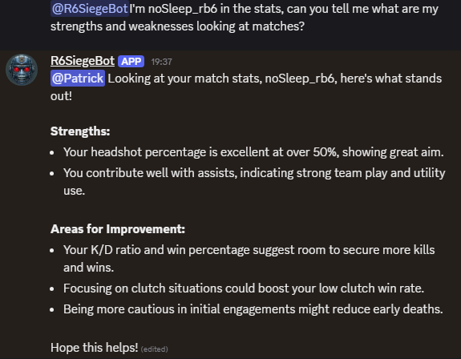

[](https://codecov.io/gh/MrDesjardins/python-discord-scheduler-bot)

# Discord Bot

The project is a Python Discord bot that aim to perform repetitive tasks for a gaming community around Ubisoft Rainbow Six Siege.

# What is this Bot doing?

1. The bot sends a daily message to a specific channel of the guild asking the user when they plan to play the game. It uses reaction by emoji for user to specify many range of hours that they plan to play.
2. The bot allows a user to specify a recurrent schedule.
3. The bot a voice message to the first user that joins the voice channel giving who is about to come play (optional).
4. The bot as administrative features with many statistics and analytic giving hindsight on the user's activity to pro-actively reaching folks.
5. The bot allows users to know everyone's timezone in a specific voice channel to help identifying the best host.
6. The bot has a tournament system allowing moderator to create a single elimination tournament with lost reporting and bracket visualization.
7. The bot allows user to place fake bets on each match of a tournament.
8. The bot has a daily stats shows the the user.
9. The bot uses the Discord activity API to determine when a user in a stack is back in the menu, ready to play and send a LFG (looking for group) message if the user is not in a full stack automatically.
10. The bot has AI generated summary of what happened in the last 24 hours in term of matches played, kills, deaths, etc. The summary is sent to a specific channel of the guild.
11. Tournament support 1v1 but also team tournament. The bot can handle 1v1, 2v2, 3v3, 4v4 and 5v5 tournaments.
12. User can communicate by at-mentioning the bot or replying to the bot's message. The bot will generate an answer based on the context of the conversation and the user's question. The bot can also answer questions about the game, statistics, and other information related to the game. This feature is powered by the Gemini and Open AI API and uses the database to fetch statistics and information about the game.

# What does the Bot look like?

## Daily Message

The bot sends a daily message to the guild asking the user when they plan to play the game. The user can react to the message with the hours they plan to play. By default, the bot fills the timeline with folks who used the `/addschedule` which allows user to set week day and time in advance. The bot automatically adjust the schedule every 15 minutes by looking at the voice channel and add people in the schedule.


# Gaming Session

Everytime someone leave a voice channels that is configured as part of the gaming voice channel, the bot collects the `active` user account and fetches the statistic.


# Tournament

The bot allows the moderator to create a single elimination tournament. The tournament is created by the moderator and the user can report the lost. The bot will generate a bracket and the user can see the progress of the tournament.


# Bets

For every tournament, user can bet on matches. The user can see the leaderboard of the bets and the active bets. The system determines the odds depending of some statistics and adjust dynamically the bet as people vote.


Every time a match is completed, the money is distributed to the winners.


# Daily Stats

The bot show stats about the last 7 days every day like the number of T/K, numbers of kills divided by matches, the most used operators by users, etc.


# Auto-LFG

The auto-lfg feature is a feature that allows the bot to send a message to the guild when a user is back in the menu (from a arcade, AI, etc or when a stack complete a rank match).


## Admin Console

The admin console allows recurrent task in development (local) or in production (Raspberry Pi). The admin can execute tests or run visualizations of the user activity.


## Visualization of User Relationship

One of the administrative feature is to see the relationship between users. The bot uses the voice channel to see who is playing with whom and generate a network graph.


The visualization is also in 3D.


## Visualization of the Inactive User

The bot keeps track of who is joining the voice channels. The bot can generate a visualization of the inactive user.


## Visualization of the Duo

The bot can analyze who is playing with whom at the same time (in the same voice channel) and create a graph of the most common duo.


## Visualization of the Total Voice Time

The bot can gives you who is the most active in the voice channels.


## Visualization of which Week Day is the Most Active per User

The bot can generate a matrix of the most active day of the week for each user.


# Bot AI Conversation

The bot can answer questions about the game, statistics, and other information related to the game. The bot uses the Gemini AI API to generate answers based on the context of the conversation and the user's question.



# Bot Commands

## User Commands

### Game Commands

#### lfg

A user in a voice channel can use the `/lfg` command to notify the other users. The command will calculate the amount of user required and post who is already in the voice channel with a `@here` mention.

### Schedule Commands

#### addschedule

User can react to a message every day or can use the `/addschedule` command to set a schedule. The command allows selecting day of the weeks and many hours. If the user executes the command multiple times, the previous schedule will be overridden.

#### removeschedule

Once a user set a schedule, they can remove it using the `/removeschedule` command or calling the `/addschedule` which will override the previous schedule.

#### seeschedule

`/seeschedule` command will show the current schedule of the user.

### Timezone Commands

#### setmytimezone

Allows a user to specify which timezone they are in.

#### getusertimezone

Allows a user to retrieve a user timezone

#### gettimezones

Allows a user to get the list of timezones of all people in a specific voice channel.

### Rank/Role Commands

#### `adjustrank`

Allows the user to type his Ubisoft account name to fetch the maximum rank he achieved and assign the role.

### Tournament Commands

#### registertournament

Every user interested to participate in the tournament must register using the `/registertournament` command.

#### reportlosttournament

Allows to report a lost. If there are many tournaments, the user needs to specify the tournament name from a list. Otherwise, only the score is required.


#### seebrackettournament

Allows to see the current bracket. The bracket is automatically updated to the tournament text channel on a report of a lost. The command allows to regenerate it.


## Moderators/Administrator Commands

### Schedule Commands

#### modadduserschedule

An administrator can add a schedule (hours) for a user for the current day.

#### modrefreshschedule

If the bot is down, call the function to refresh the cache from the reaction of the message.

#### modforcesendschedule

Force sending the daily question regardless if it was already sent or not (in the cache). Useful if the cache has the value that the message was sent but it crashed and the message was never sent.

#### modapplyschedule

Force the bot to check the cache for user's schedule and apply it on the current day.

### Timezone commands

#### modsetusertimezone

Allows an administrator to set the timezone of a user.

### Channels Commands

### modtextschedulechannel

The bot needs to send daily messages to a specific channel of the guild. The action specifies which channel the bot will send a daily message. Without this configuration, the bot will skip the guild daily message.

#### modseeschedulechannel

Allows to see what is the text channel configured for the guild to send the schedule every day.

#### modvoicechannel

The bot needs to know which voice channel to check for the guild. The action specify which channel the bot check activity. Without this configuration, the bot will skip the voice participation. Calling the function many times adds up the voice channels.

#### modseevoicechannels

Allows to see what is the voice channels configured for the guild.

#### modresetvoicechannel

Remove all voice channels configuration. It is good to reset and add the voice channels again.

### Tournament Commands

#### modcreatetournament

The moderator can create many tournaments. The tournament is a single elimination tournament. The tournament is created with a name and the number of players. The tournament is created with the current date and time.


#### modreportlost

In case a user does not report a lost, a moderator can unblock the tournament by reporting the lost on the behalf of the user

#### modtexttournamentchannel

Set the text channel to send the bracket and messages about the tournament

#### modseestournamentchannel

Allows to see what is the text channel configured for the guild to send the tournament information.

### Betting Commands

#### betleaderboard

User can see who won the most for a specific tournament in term of bets.

#### betactivetournament

User can see the active (not closed) bet for a specific tournament that every user placed.

#### bet

User can place a bet on a specific user for a specific tournament.

#### betwallet

User can see how much money they have in their wallet.

### Bot Behaviors

#### modenablebotvoice

Turn on and off the feature that the bot goes into the voice channel to send a voice mesage to the first user.

### Analytics

#### modshowcommunity

Generate an image that is a network graph of the useer and with whom they play the most.

#### modversion

Give the latest SHA of the commit. Helps to ensure that the bot is running the latest version.

## Owner Commands

### modresetcache

Reset the cache for the administration guild.

# Discord Administration

## Discord Configuration

### Set Up a Discord Bot Account

Create a Discord Application:

1. https://discord.com/developers/applications
1. Click on "New Application" and give it a name.
1. Currently, this application has two applications: `GameTimeScheduler` and `GameTimeScheduler_Dev`. The first one is for production and the second one is for development.

### Create a Bot:

In your application, navigate to the "Bot" tab.

1. Click "Add Bot" and confirm.
1. Under "TOKEN", click "Copy" to get your bot's token. Keep this token secure!

### Invite the Bot to Your Server:

Navigate to the `OAuth2` tab and then `URL Generator`.
Under `Scopes` select:

1. `bot`
1. `applications.commands`

Under "Bot Permissions", select the necessary permissions:

1. View Audit Log
1. Manage Roles
1. Manage Channels
1. View Channels
1. Send Messages
1. Manage Messages
1. Read Message History
1. Mention Everyone
1. Add Reactions

Copy the generated URL and open it in your browser to invite the bot to your desired server.

```sh
# Production Bot
https://discord.com/oauth2/authorize?client_id=1279592054996996219&permissions=268641488&redirect_uri=https%3A%2F%2Fdiscord.com%2Foauth2%2Fauthorize&integration_type=0&scope=bot+applications.commands

# Dev Bot
https://discord.com/oauth2/authorize?client_id=1282412272458924103&permissions=268641488&redirect_uri=https%3A%2F%2Fdiscord.com%2Foauth2%2Fauthorize&integration_type=0&scope=bot+applications.commands
```

You also need the `Presence Intent` to be checked (located above the bot permission, same page). This will allows the bot to see who is playing the game and what is the status of the user (menu, playing, etc).

# Create a TRN Developer Account

To get the statistics of the user, you need to create a developer account on the TRN website. The TRN API is used to get the statistics of the user. The API key is required to get the statistics of the user.

1. Create an account on the TRN website: https://tracker.gg/developers
2. E.g. https://tracker.gg/developers/apps/330f2e3d-c58f-4170-a4c1-65710ba2e55d

# Local Development Configuration

## .Env file

The .env file should contain the following in development. These values should be kept secret and be
environment variable for your private deployment.

```
ENV=dev # or prod
BOT_TOKEN=<bot token>
BOT_TOKEN_DEV=<bot token>
GEMINI_API_KEY=<gemini api token>
OPENAI_API_KEY=<open ai api token>
```

## Running the bot in Dev:

To run the bot in development, you can use the following commands.

```sh
source .venv/bin/activate
python3 bot.py # or ./bot.py
```


# Installation on a Raspberry Pi

1. Update the sources list for apt packages (required in some Raspberry Pi to get Python3) by editing `/etc/apt/sources.list`

```
deb http://raspbian.raspberrypi.org/raspbian/ buster main contrib non-free rpi
```

2. Upgrade apt packages `sudo apt-get update` and upgrade `sudo apt-get upgrade`
3. SSH into the Raspberry Pi
4. `ssh pi@10.0.0.192`
5. Clone the repository
6. `git clone https://github.com/MrDesjardins/python-discord-scheduler-bot.git`
7. Install `uv`: `curl -LsSf https://astral.sh/uv/install.sh | sh` 
8. Edit the environment variables file `/etc/environment` (require sudo)

```sh
ENV=prod
BOT_TOKEN=<bot token>
TRN_API_KEY<TRN token>
GEMINI_API_KEY=<api key>
OPENAI_API_KEY=<api key>
```

11. Install ffmpeg for the audio

```sh
sudo apt-get install ffmpeg
```

12. Install SqlLite3 for analytic

```sh
sudo apt install sqlite3
```

13. Install OpenBLAS for numpy used in the generation of relation analytic between user. This might require other dependencies and must have the latest APT packages.

```sh
sudo apt-get install libopenblas-base
sudo apt-get install libjpeg-dev zlib1g-dev libtiff-dev libopenjp2-7-dev
```

14. Install the systemd that will run the bot at startup

```sh
sudo cp /home/pi/python-discord-scheduler-bot/systemd/gametimescheduler.service /etc/systemd/system/gametimescheduler.service
sudo systemctl enable gametimescheduler.service
sudo systemctl start gametimescheduler.service
```

15. Install Chrome for the web scraping

```sh
sudo apt install -y xvfb
sudo apt install chromium-browser chromium-chromedriver
sudo chown pi:pi /usr/bin/chromedriver
```

## Python Environment and Dependencies

Here are few commands to set up the environment and dependencies.

### Only do this in the Raspberry PI:
```sh
sudo nano ~/.config/pip/pip.conf
```
Set the current index which focus on Raspberry PI supported packages with fallback to generic:
```
[global]
index-url = https://www.piwheels.org/simple
extra-index-url = https://pypi.org/simple
```
Then install Python by building:

```sh
sudo apt update
sudo apt install -y \
  build-essential \
  libffi-dev \
  libbz2-dev \
  liblzma-dev \
  libsqlite3-dev \
  libssl-dev \
  zlib1g-dev \
  libncurses5-dev \
  libgdbm-dev \
  libreadline-dev \
  tk-dev \
  uuid-dev

cd /usr/src
sudo wget https://www.python.org/ftp/python/3.10.14/Python-3.10.14.tgz
sudo tar xzf Python-3.10.14.tgz

cd /usr/src/Python-3.10.14
sudo make clean

CPPFLAGS="-I/usr/include/arm-linux-gnueabihf" \
LDFLAGS="-L/usr/lib/arm-linux-gnueabihf" \
./configure --enable-optimizations

make -j4
sudo make altinstall
```

### Everywhere:

```sh
# Install system dependencies
sudo apt update
sudo apt install -y \
  build-essential \
  libffi-dev \
  libbz2-dev \
  liblzma-dev \
  libsqlite3-dev \
  libssl-dev \
  zlib1g-dev \
  libncurses5-dev \
  libgdbm-dev \
  libreadline-dev \
  tk-dev \
  uuid-dev

PIP_INDEX_URL=https://pypi.org/simple pip install cffi

```

## SQLite3

Add in your `~/.zshrc` or `~/.bashrc` the following line to have the SQLite3 headers and columns configuration from the root .sqliterc file.

```sh
alias sqlite3="sqlite3 --init .sqliterc"
```

## Debugging

If the service does not start, you can check the status of the service with the following command:

```sh
sudo systemctl status gametimescheduler.service
```

You can check the log in the service journal:

```sh
sudo journalctl -u gametimescheduler.service --reverse
```

Real-time check:

```sh
sudo journalctl -u gametimescheduler.service -n 500 -f
```

Checking the log file (last 200 or real-time):

```sh
tail -n 200 app.log
tail -n 200 app.log -f
```

## Linting

To lint the code, you can use the following command:

```sh
pylint **/*.py
black **/*.py
mypy deps
mypy cogs
mypy tests
```

# Deployment

The best way to code and publish a new version is to code, push in GitHub, and then pull the code in the Raspberry Pi. The script `deployment/update.sh` does the fetching, install the dependencies and restart the service.

```sh
deployment/update.sh
```

# Analytic Data

The bot listen to the voice channels selected by the administrator and store the data in a database. The analytic concerns the user, the channel, the time in/out. The goal is establishing pattern which may help in the future scheduling and also see if how we may predict the user's activity and suggest partners.

Information are in the `user_activity.db` database. You can access the database using the following command which download the database in the current directory and open it.

```sh
analytics/transfer.sh
sqlite3 user_activity.db
```

You can also while developing using the test script with `python3 test_analytics_fake_date.py` which will use the local database and generate fake data. You can see the data but also the generated images.

# Unit Tests

```sh
pytest -v -s ./tests/*_unit_test.py
```

# Integration Tests

```sh
pytest -v -s ./tests/*_integration_test.py
```

# Coverage Tests on Unit Tests

```sh
coverage run --omit="./tests/*" -m pytest -v -s ./tests/*unit_test.py && coverage html
```

# Space Issue

Logs can accumulate and make the Raspberri Pi run out of space. You can remove the logs by running the following command:

Check the size of large files on the Raspberry Pi:

```sh
sudo find / -type f -size +50M -exec ls -lh {} \; | awk '{ print $9 ": " $5 }'
```

See what is the issue with logs:

```sh
sudo du -h --max-depth=1 /var/log | sort -rh
```

To see the journal size:

```sh
sudo journalctl --disk-usage
```

Reduce the journal logs, kill the logs for syslog and deamon log:

```sh
sudo truncate -s 0 /var/log/daemon.log
sudo truncate -s 0 /var/log/syslog
sudo journalctl --vacuum-size=100M
sudo journalctl --vacuum-time=7d
```

Configure journal and syslog retention:

```sh
sudo journalctl --vacuum-size=100M
sudo nano /etc/logrotate.d/rsyslog
sudo systemctl restart rsyslog
sudo nano /etc/systemd/journald.conf
SystemMaxUse=100M
```
# Todos

1. 